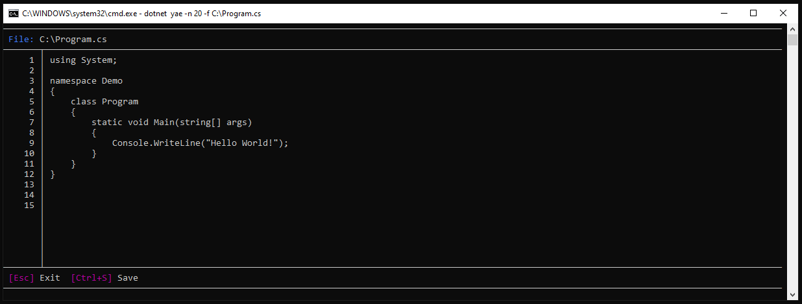

# yae - yet another editor

### Summary

Console-based text editor tool for .NET Core CLI.

### Install

Yae uses [.NET Core CLI](https://docs.microsoft.com/en-us/dotnet/core/tools/) toolchain for installing.

#### global tool

To install tool:
 
```text
git clone https://github.com/daredever/yae.git
cd src/YaeTool/
dotnet pack
dotnet tool install --global --add-source ./nupkg YaeTool
```

To uninstall tool:
 
```text
dotnet tool uninstall -g YaeTool
```
 
#### local tool

To setup tool for all directories first run:
```text
cd \
dotnet new tool-manifest
```

To setup tool for current directory just run:
```text
dotnet new tool-manifest
```

To install tool:
 
```text
git clone https://github.com/daredever/yae.git
cd src/YaeTool/
dotnet pack
dotnet tool install --add-source ./nupkg YaeTool
```

To uninstall tool:
 
```text
dotnet tool uninstall YaeTool
```

### Run

Options:

- get help :  *-h | --help*
- get version : *-v | --version*
- open file : *-f | --file \<FILE\>*
- set editor lines per page count : *-n | --count \<COUNT\>*

Examples for local tool:
 
```text
dotnet yae -h
dotnet yae -v
dotnet yae -f file.txt
dotnet yae -f C:\file.txt
dotnet yae -n 30 -f C:\file.txt
```

Examples for global tool:
 
```text
yae -h
yae -v
yae -f file.txt
yae -f C:\file.txt
yae -n 30 -f C:\file.txt
```

Editor window:



### Templates

There are 4 file templates:
- Class
- Enum
- Interface
- Struct

All of them create files in the current directory and a base type content.

To install:
```text
cd src/Yae.Templates
dotnet new -i ClassTemplate
dotnet new -i EnumTemplate
dotnet new -i InterfaceTemplate
dotnet new -i StructTemplate
```

To use:
```text
dotnet new class -t Car
dotnet new enum -t Color
dotnet new interface -t IPerson
dotnet new struct -t Point
```

Options:
- set namespace (default current directory) :  *-n \<NAMESPACE\>*
- set output (default current directory) : *-o \<OUTPUT\>* 
- set type name : *-t \<TYPE_NAME\>*
